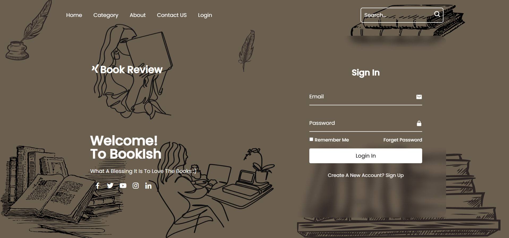
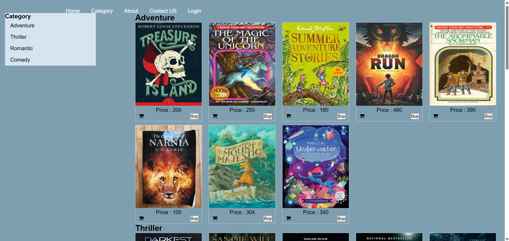

# book-review-web-application
Database-backed book catalog website with user login, category browsing, searchable book listings, detailed book pages, and cart-related actions.

## Technologies

- HTML5
- CSS3
- JavaScript
- PHP
- MySQL
- phpMyAdmin for database inspection and administration

## Features

- Landing page with navigation and search
- User login interface
- Category-based book catalog
- Individual book-description pages
- Book metadata including title, author, publisher, year, and description
- `Buy Now` and `Add to Cart` actions in the documented interface
- Team/About page
- Contact form
- Database-backed book records

## User Flow

1. Open the home page.
2. Search for a book or browse the available categories.
3. Select a book to view its description and publication details.
4. Use the available purchase or cart action.
5. Sign in when account access is required.
6. Use the Contact page to submit an inquiry.

## Development Process

1. Planned the main pages for book discovery, account access, book details, team information, and contact.
2. Created a themed interface for the Bookish website.
3. Organized books into a category-based catalog.
4. Created detailed pages containing book metadata and descriptions.
5. Connected the website to a database containing book records.
6. Added login, search, cart-related controls, and a contact form to support the documented user flow.

## Running the Project

### Requirements

- A local web-server environment with PHP and MySQL
- A browser
- phpMyAdmin or another MySQL client

### Setup

1. Clone the repository into the document-root folder of your PHP web server.
2. Create a MySQL database and import `book_database.sql`.
3. Open `connection.php` and update the database host, username, password, and database name for your local environment.
4. Start the PHP web server and MySQL.
5. Open the project through the server URL rather than opening `index.html` directly.

> The exact PHP/MySQL versions, database name, and local URL must be added after the recovered project is tested. 

## What We Learned

- How to organize a multi-page website around a clear navigation flow
- How to present and categorize database-backed book information
- How to design login, catalog, details, About, and Contact interfaces
- How to connect a web interface with stored database records
- How to divide and present a team-based web project

## Possible Improvements

- Add verified user-written reviews and ratings
- Add filters for author, genre, publication year, and price
- Implement secure password hashing and server-side validation
- Add prepared database statements and error handling
- Add cart persistence and a documented checkout flow
  
## Screenshots

---

---

---
## Contributors

- Mansiba Gohil
